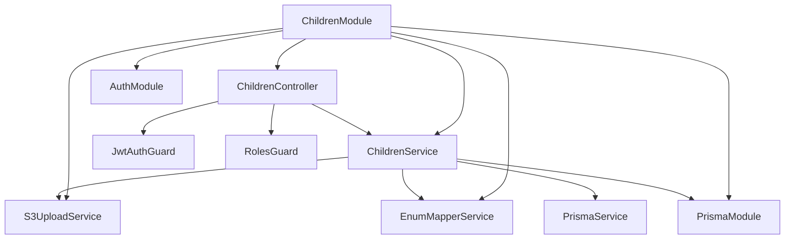

# Children Module Backend API - Technical Design Document

## Overview

The Children Module Backend API is a comprehensive RESTful service built with NestJS that manages child records in the Orphan Age Child Safety System. This module serves as the backend for a React + Vite frontend providing three key pages: children list view, child profile detail view, and child registration form.

### Purpose

This API enables orphanages and administrators to:
- Register new children with photo upload to AWS S3
- Retrieve paginated lists with search and role-based filtering
- View comprehensive child profiles with medical, education, and adoption data
- Track dashboard statistics for operational oversight

### Key Design Principles

1. **Role-Based Access Control**: Admin users access all data; Orphanage staff see only their orphanage's children
2. **Enum Mapping**: Bidirectional conversion between frontend strings and Prisma SCREAMING_SNAKE_CASE enums
3. **Cloud Storage**: AWS S3 integration for secure photo storage
4. **Performance**: Query optimization with indexing for 1000+ record datasets
5. **Data Integrity**: Transaction management with rollback on failures
6. **Audit Compliance**: Comprehensive logging of all operations

### Technology Stack

- **Framework**: NestJS 10.x with TypeScript
- **ORM**: Prisma Client (PostgreSQL)
- **Authentication**: JWT with Passport
- **Validation**: class-validator + class-transformer
- **File Upload**: Multer (memory storage)
- **Cloud Storage**: AWS SDK v3 for S3
- **Documentation**: Swagger/OpenAPI
- **Testing**: Jest for unit/integration tests


## Architecture

### Module Structure

```
backend/src/children/
├── children.module.ts           # Module definition with providers and imports
├── children.controller.ts       # HTTP endpoint handlers
├── children.service.ts          # Core business logic and database operations
├── dto/
│   ├── create-child.dto.ts      # Child registration request DTO
│   ├── query-children.dto.ts    # Pagination and search query DTO
│   ├── child-list-response.dto.ts    # List endpoint response DTO
│   ├── child-profile-response.dto.ts # Detail endpoint response DTO
│   └── child-stats-response.dto.ts   # Statistics endpoint response DTO
├── services/
│   ├── s3-upload.service.ts     # AWS S3 photo upload logic
│   └── enum-mapper.service.ts   # Bidirectional enum conversion
├── interfaces/
│   ├── child-list-item.interface.ts  # List item structure
│   ├── child-profile.interface.ts    # Profile structure
│   └── s3-upload-result.interface.ts # S3 upload return type
├── exceptions/
│   ├── child-not-found.exception.ts        # 404 exception
│   └── unauthorized-orphanage-access.exception.ts # 403 exception
├── constants/
│   └── children.constants.ts    # Configuration constants
└── enums/
    └── children.enums.ts        # Enum type definitions (if needed)
```

### Dependency Graph




### Service Layer Organization

#### ChildrenService

Core business logic orchestration:
- Child registration with transaction management
- List retrieval with role-based filtering
- Detail retrieval with comprehensive joins
- Statistics computation with aggregate queries
- Child code auto-generation
- Computed field calculations (age, attendance %, risk level)

#### S3UploadService

AWS S3 integration:
- Photo upload to S3 bucket
- Path organization: `children/{childCode}/photo-{timestamp}.{ext}`
- Presigned URL generation (if needed for future)
- Error handling and retry logic
- Transaction rollback integration

#### EnumMapperService

Bidirectional enum conversion:
- Frontend string → Prisma enum (e.g., "Male" → ChildGender.MALE)
- Prisma enum → Frontend string (e.g., BloodGroup.A_POSITIVE → "A+")
- Validation of enum values
- Type-safe mapping with TypeScript generics

### Controller Design Pattern

All endpoints follow this pattern:
1. **Authentication**: JWT token extraction via `@UseGuards(JwtAuthGuard)`
2. **Authorization**: Role verification via `@UseGuards(RolesGuard)` + `@Roles('ADMIN', 'ORPHANAGE')`
3. **Validation**: Automatic DTO validation via class-validator
4. **Service Call**: Delegate business logic to service layer
5. **Response Mapping**: Transform Prisma entities to response DTOs
6. **Error Handling**: Global exception filter catches and formats errors


## Components and Interfaces

### API Endpoints

#### 1. Child Registration Endpoint

**HTTP Method**: `POST`  
**Path**: `/children`  
**Authentication**: Required (JWT)  
**Authorization**: `ADMIN | ORPHANAGE`  
**Content-Type**: `multipart/form-data`

**Request Schema**:
```typescript
{
  name: string;              // Required, 2-100 chars
  age: number;               // Required, 0-18
  gender: string;            // Required, "Male" | "Female" | "Other"
  bloodGroup: string;        // Required, "A+" | "A-" | "B+" | "B-" | "AB+" | "AB-" | "O+" | "O-"
  admissionDate: string;     // Required, ISO 8601 date, not future
  foundLocation: string;     // Required, 5-200 chars
  risk: string;              // Required, "Low" | "Medium" | "High"
  medicalCondition: string;  // Required, 5-500 chars
  identificationMarks: string; // Required, 5-500 chars
  notes: string;             // Required, 10-1000 chars
  orphanage?: string;        // Optional (auto-set for ORPHANAGE role), UUID
  photo: File;               // Required, image/jpeg or image/png, max 5MB
}
```

**Response Schema (201 Created)**:
```typescript
{
  statusCode: 201;
  message: "Child registered successfully";
  data: {
    childId: string;    // UUID
    childCode: string;  // CHD-YYYY-NNNNNN
  }
}
```

**Error Responses**:
- `400 Bad Request`: Validation errors (multiple field messages)
- `401 Unauthorized`: Missing or invalid JWT
- `403 Forbidden`: Insufficient permissions
- `413 Payload Too Large`: Photo exceeds 5MB
- `500 Internal Server Error`: Child code generation failure or S3 upload failure


#### 2. Child List Retrieval Endpoint

**HTTP Method**: `GET`  
**Path**: `/children`  
**Authentication**: Required (JWT)  
**Authorization**: `ADMIN | ORPHANAGE`

**Query Parameters**:
```typescript
{
  page?: number;    // Optional, default 1, min 1
  limit?: number;   // Optional, default 8, min 1, max 100
  search?: string;  // Optional, search in childCode, name, orphanage name, risk level
}
```

**Response Schema (200 OK)**:
```typescript
{
  statusCode: 200;
  data: {
    total: number;          // Total matching records
    page: number;           // Current page
    totalPages: number;     // Calculated: Math.ceil(total / limit)
    items: ChildListItem[]; // Array of child records
  }
}

interface ChildListItem {
  id: string;                  // UUID
  childId: string;             // childCode (CHD-YYYY-NNNNNN)
  name: string;                // Full name
  age: number;                 // Computed from dateOfBirth or approximateAge
  orphanage: string;           // Orphanage name
  riskLevel: string;           // "Low" | "Medium" | "High"
  healthStatus: string;        // "Stable" | "Observation" | "Needs Review"
  attendancePercentage: number; // Computed as (PRESENT / total) * 100
}
```

**Error Responses**:
- `400 Bad Request`: Invalid query parameters
- `401 Unauthorized`: Missing or invalid JWT
- `403 Forbidden`: Insufficient permissions


#### 3. Child Statistics Endpoint

**HTTP Method**: `GET`  
**Path**: `/children/stats`  
**Authentication**: Required (JWT)  
**Authorization**: `ADMIN | ORPHANAGE`

**Response Schema (200 OK)**:
```typescript
{
  statusCode: 200;
  data: {
    total: number;   // Count where isActive = true
    high: number;    // Count where latest riskLevel = HIGH or CRITICAL
    adopted: number; // Count where adoptionStatus = COMPLETED
    review: number;  // Count where healthStatus = CRITICAL
  }
}
```

**Error Responses**:
- `401 Unauthorized`: Missing or invalid JWT
- `403 Forbidden`: Insufficient permissions


#### 4. Child Profile Retrieval Endpoint

**HTTP Method**: `GET`  
**Path**: `/children/:childId`  
**Authentication**: Required (JWT)  
**Authorization**: `ADMIN | ORPHANAGE`

**Path Parameters**:
```typescript
{
  childId: string;  // UUID
}
```

**Response Schema (200 OK)**:
```typescript
{
  statusCode: 200;
  data: ChildProfile;
}

interface ChildProfile {
  // Basic Information
  id: string;
  childId: string;              // childCode
  name: string;
  age: number;                  // Computed
  gender: string;
  dateOfBirth?: string;
  bloodGroup: string;
  photo: string | null;         // S3 URL or null
  
  // Admission Details
  admissionDate: string;
  foundLocation: string;
  identificationMarks: string;
  notes: string;
  orphanage: string;            // Orphanage name
  
  // Health & Medical
  healthStatus: string;         // "Stable" | "Observation" | "Needs Review"
  medicalHistory: MedicalHistoryItem[];
  healthReports: HealthReportItem[];
  
  // Education
  educationLevel: string | null;
  schoolName: string | null;
  
  // Safety & Monitoring
  riskLevel: string;            // "Low" | "Medium" | "High"
  aiSafetyScore: number;        // Percentage from latest AIRiskScore
  attendancePercentage: number;
  
  // Adoption Information
  adoptionStatus: string;
  isAdopted: boolean;
  guardian?: GuardianDetails;   // Only if adopted
  
  // Documents
  documents: DocumentItem[];
}
```


**Sub-interfaces**:
```typescript
interface MedicalHistoryItem {
  conditionName: string;
  severity: string;
  diagnosedDate: string | null;
  isCurrent: boolean;
  treatmentDetails: string | null;
}

interface HealthReportItem {
  reportDate: string;
  healthStatus: string;
  findings: string | null;
  diagnosis: string | null;
}

interface GuardianDetails {
  fatherName: string | null;
  motherName: string | null;
  fatherPhone: string | null;
  motherPhone: string | null;
  email: string | null;
  address: string | null;
  adoptionOrderId: string | null;
  followUpOfficer: string | null;
}

interface DocumentItem {
  documentType: string;
  fileName: string;
  storageUrl: string | null;
  uploadedAt: string;
}
```

**Error Responses**:
- `401 Unauthorized`: Missing or invalid JWT
- `403 Forbidden`: ORPHANAGE role attempting to access child from different orphanage
- `404 Not Found`: Child record does not exist


## Data Models

### Database Design

#### Child Record Schema (Prisma)

```prisma
model Child {
  id        String  @id @default(uuid())
  childCode String  @unique
  
  orphanageId String?
  orphanage   Orphanage? @relation(fields: [orphanageId], references: [id])
  
  firstName      String
  lastName       String?
  dateOfBirth    DateTime?
  approximateAge Int?
  gender         ChildGender
  bloodGroup     BloodGroup
  
  photo String?
  
  healthStatus  HealthStatus
  currentStatus ChildStatus
  adoptionStatus AdoptionStatus
  isAdoptable Boolean
  isActive Boolean
  
  admissionDate DateTime
  admissionReason String?
  foundLocation String?
  distinguishingMarks String?
  specialNotes String?
  internalNotes String?
  
  // Relations
  medicalHistories  MedicalHistory[]
  healthReports     HealthReport[]
  attendanceRecords AttendanceRecord[]
  educationRecords  EducationRecord[]
  guardianHistories GuardianHistory[]
  documents         ChildDocument[]
  adoptionRecord    AdoptionRecord?
  aiRiskScores      AIRiskScore[]
  
  createdAt DateTime @default(now())
  updatedAt DateTime @updatedAt
  
  @@index([orphanageId])
  @@index([currentStatus])
  @@index([adoptionStatus])
  @@index([isActive])
}
```


#### Prisma Query Patterns

**Child Registration Query**:
```typescript
// Inside transaction
const child = await prisma.child.create({
  data: {
    childCode: generatedCode,
    firstName,
    lastName,
    gender: mappedGender,
    bloodGroup: mappedBloodGroup,
    approximateAge: age,
    admissionDate: new Date(admissionDate),
    foundLocation,
    distinguishingMarks: identificationMarks,
    specialNotes: notes,
    healthStatus: HealthStatus.UNKNOWN,
    currentStatus: ChildStatus.REGISTERED,
    adoptionStatus: AdoptionStatus.NOT_INITIATED,
    isAdoptable: false,
    isActive: true,
    photo: s3Url,
    orphanageId: resolvedOrphanageId,
  },
  select: {
    id: true,
    childCode: true,
  },
});
```

**Child List Query with Role Filter**:
```typescript
const whereClause = {
  isActive: true,
  ...(user.role === 'ORPHANAGE' && {
    orphanageId: user.orphanageStaff[0].orphanageId,
  }),
  ...(search && {
    OR: [
      { childCode: { contains: search, mode: 'insensitive' } },
      { firstName: { contains: search, mode: 'insensitive' } },
      { lastName: { contains: search, mode: 'insensitive' } },
      { orphanage: { name: { contains: search, mode: 'insensitive' } } },
    ],
  }),
};

const [children, total] = await prisma.$transaction([
  prisma.child.findMany({
    where: whereClause,
    skip: (page - 1) * limit,
    take: limit,
    include: {
      orphanage: { select: { name: true } },
      aiRiskScores: {
        orderBy: { computedAt: 'desc' },
        take: 1,
        select: { riskLevel: true },
      },
      attendanceRecords: {
        select: { status: true },
      },
    },
  }),
  prisma.child.count({ where: whereClause }),
]);
```


**Child Profile Query (8+ Joins)**:
```typescript
const child = await prisma.child.findUnique({
  where: { id: childId },
  include: {
    orphanage: {
      select: { name: true },
    },
    medicalHistories: {
      where: { isCurrent: true },
      select: {
        conditionName: true,
        severity: true,
        diagnosedDate: true,
        isCurrent: true,
        treatmentDetails: true,
      },
    },
    healthReports: {
      orderBy: { reportDate: 'desc' },
      take: 5,
      select: {
        reportDate: true,
        healthStatus: true,
        findings: true,
        diagnosis: true,
      },
    },
    attendanceRecords: {
      select: { status: true },
    },
    educationRecords: {
      where: { isCurrent: true },
      take: 1,
      select: {
        level: true,
        schoolName: true,
      },
    },
    aiRiskScores: {
      orderBy: { computedAt: 'desc' },
      take: 1,
      select: {
        riskLevel: true,
        score: true,
      },
    },
    adoptionRecord: {
      include: {
        adoptiveParent: {
          include: {
            user: {
              select: {
                firstName: true,
                lastName: true,
                phone: true,
                email: true,
              },
            },
            addresses: {
              where: { isPrimary: true },
              take: 1,
              select: {
                addressLine1: true,
                city: true,
                state: true,
                pincode: true,
              },
            },
          },
        },
      },
    },
    guardianHistories: {
      where: { isCurrent: true },
      take: 1,
    },
    documents: {
      select: {
        documentType: true,
        fileName: true,
        storageUrl: true,
        createdAt: true,
      },
    },
  },
});
```


**Statistics Aggregate Query**:
```typescript
const whereClause = {
  isActive: true,
  ...(user.role === 'ORPHANAGE' && {
    orphanageId: user.orphanageStaff[0].orphanageId,
  }),
};

const [total, highRisk, adopted, needsReview] = await prisma.$transaction([
  // Total active children
  prisma.child.count({
    where: whereClause,
  }),
  
  // High risk children
  prisma.child.count({
    where: {
      ...whereClause,
      aiRiskScores: {
        some: {
          riskLevel: { in: ['HIGH', 'CRITICAL'] },
          computedAt: {
            // Latest score only (using subquery pattern)
            equals: prisma.aIRiskScore.findFirst({
              where: { childId: child.id },
              orderBy: { computedAt: 'desc' },
              select: { computedAt: true },
            }).computedAt,
          },
        },
      },
    },
  }),
  
  // Adopted children
  prisma.child.count({
    where: {
      ...whereClause,
      adoptionStatus: 'COMPLETED',
    },
  }),
  
  // Needs medical review
  prisma.child.count({
    where: {
      ...whereClause,
      healthStatus: 'CRITICAL',
    },
  }),
]);
```

**Index Usage Strategy**:
- `orphanageId` index: Role-based filtering
- `isActive` index: Active record filtering
- `currentStatus` index: Status-based queries
- `adoptionStatus` index: Adoption statistics
- Composite index `[orphanageId, isActive]`: Combined filtering


### DTO Design

#### CreateChildDto

```typescript
import { IsString, IsNumber, IsNotEmpty, IsEnum, IsDateString, IsOptional, IsUUID, Length, Min, Max } from 'class-validator';
import { ApiProperty, ApiPropertyOptional } from '@nestjs/swagger';

export class CreateChildDto {
  @ApiProperty({
    description: 'Full name of the child',
    example: 'Raj Kumar',
    minLength: 2,
    maxLength: 100,
  })
  @IsString()
  @IsNotEmpty({ message: 'name should not be empty' })
  @Length(2, 100, { message: 'Name must be between 2 and 100 characters' })
  name: string;

  @ApiProperty({
    description: 'Age of the child in years',
    example: 8,
    minimum: 0,
    maximum: 18,
  })
  @IsNumber({}, { message: 'age must be a number' })
  @IsNotEmpty({ message: 'age should not be empty' })
  @Min(0, { message: 'Age must not be less than 0' })
  @Max(18, { message: 'Age must not be greater than 18' })
  age: number;

  @ApiProperty({
    description: 'Gender of the child',
    example: 'Male',
    enum: ['Male', 'Female', 'Other'],
  })
  @IsString()
  @IsNotEmpty({ message: 'gender should not be empty' })
  @IsEnum(['Male', 'Female', 'Other'], {
    message: 'gender must be one of the following values: Male, Female, Other',
  })
  gender: string;

  @ApiProperty({
    description: 'Blood group',
    example: 'A+',
    enum: ['A+', 'A-', 'B+', 'B-', 'AB+', 'AB-', 'O+', 'O-'],
  })
  @IsString()
  @IsNotEmpty({ message: 'bloodGroup should not be empty' })
  @IsEnum(['A+', 'A-', 'B+', 'B-', 'AB+', 'AB-', 'O+', 'O-'], {
    message: 'bloodGroup must be one of the following values: A+, A-, B+, B-, AB+, AB-, O+, O-',
  })
  bloodGroup: string;
```

